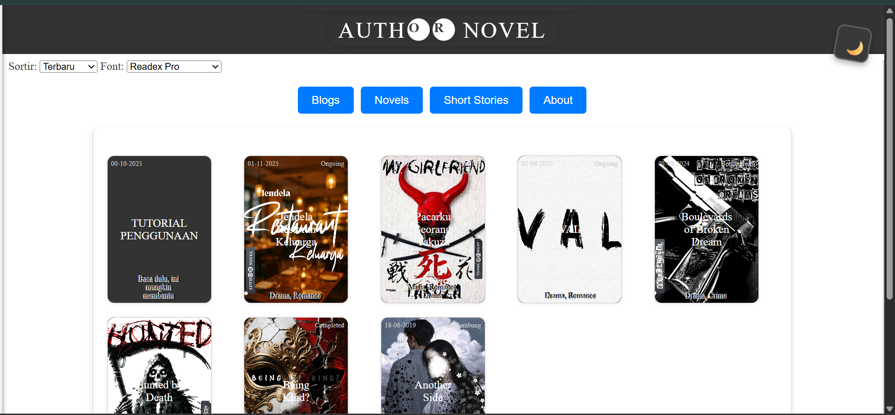

# Author Novel



Baca novel online, gratis selamanya. Platform untuk membaca novel, cerita pendek, dan blog secara daring tanpa biaya.

## Deskripsi

Author Novel adalah situs web statis yang memungkinkan pengguna untuk membaca berbagai novel, cerita pendek, dan artikel blog secara gratis. Situs ini dirancang dengan antarmuka yang ramah pengguna, fitur kustomisasi font, mode gelap, dan navigasi bab yang mudah.

## Fitur

- **Baca Novel**: Koleksi novel lengkap dengan bab-bab yang terorganisir.
- **Cerita Pendek**: Akses ke cerita pendek yang menarik.
- **Blog**: Artikel dan informasi terkini.
- **Kustomisasi Font**: Pilih dari berbagai jenis font dan ukuran.
- **Mode Gelap**: Beralih antara mode terang dan gelap.
- **Pengurutan**: Urutkan konten berdasarkan tanggal atau nama.
- **Navigasi Bab**: Navigasi mudah antar bab dengan tombol sebelumnya/berikutnya.
- **Responsif**: Kompatibel dengan desktop dan perangkat mobile.
- **Penyimpanan Lokal**: Ingat bab terakhir yang dibaca.

## Teknologi

- **HTML5**: Struktur halaman web.
- **CSS3**: Styling dan animasi.
- **JavaScript (Vanilla)**: Logika interaktif dan pengelolaan konten.
- **Markdown**: Format konten novel dan artikel.
- **GitHub Pages**: Hosting situs web.

## Penggunaan

Kunjungi situs web di [https://authorkejam.github.io/authornovel/](https://authorkejam.github.io/authornovel/) untuk mulai membaca.

## Struktur Proyek

```
authornovel/
├── index.html          # Halaman utama
├── style.css           # Styling CSS
├── alert.js            # Skrip alert
├── data/
│   ├── novel.js        # Data novel
│   ├── short.js        # Data cerita pendek
│   ├── blog.js         # Data blog
│   └── about.js        # Data tentang
├── Novel/              # Folder novel
│   ├── [nama-novel]/
│   │   ├── chapter1.md
│   │   └── ...
├── Short/              # Folder cerita pendek
├── Blog/               # Folder blog
├── About/              # Folder tentang
├── cover/              # Gambar cover
├── logo/               # Logo dan ikon
├── readme-cover.png    # Gambar cover README
├── weblogo.png         # Logo web
└── README.md           # File ini
```

## Lisensi

&copy;2025 Author Kejam Blog. All rights reserved.

---

Dibuat dengan ❤️ oleh Author Kejam.
